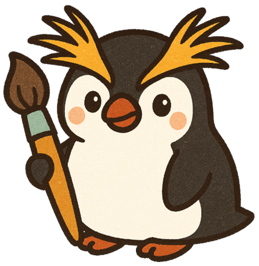

<div align="center">
  
  <h1>PENPEN</h1>
  <p>免費、純前端、無需安裝的瀏覽器圖像編輯器</p>
  <p>
    <a href="https://dontpkme993.github.io/penpen/">🚀 線上使用</a>
    ·
    <a href="https://github.com/dontpkme993/penpen/issues">回報問題</a>
  </p>
  
  
  
</div>

---

## 簡介

PENPEN 是一款完全在瀏覽器中運行的圖像編輯器，基於 HTML5 Canvas 開發，無需安裝、無需後端、無需帳號。支援多圖層編輯、豐富的繪圖工具、影像調整與濾鏡，以及透過 [Transformers.js](https://huggingface.co/docs/transformers.js) 在本地運行的 AI 功能。

> 在 AI 寫 code 時代，重複發明輪子又何妨？我能讓這個輪子照著我喜歡的方向轉，而且不怕它轉一轉突然就跟我收費

---

## 功能特色

### 繪圖與編輯工具

| 工具 | 快捷鍵 | 說明 |
|------|--------|------|
| 移動 | `V` | 移動圖層內容 |
| 矩形 / 橢圓選取 | `M` | 建立規則形狀選取範圍 |
| 套索 / 多邊形選取 | — | 自由曲線或多邊形選取 |
| 魔術棒 | — | 依顏色容差自動選取相鄰區域 |
| 裁切 | `C` | 裁切畫布至指定範圍，支援自動裁切 |
| 自由變形 / 縮放 / 旋轉 | — | 對圖層內容進行幾何變換 |
| 筆刷 / 鉛筆 | `B` | 可調整大小、不透明度、硬度與筆刷形狀 |
| 橡皮擦 | `E` | 擦除為透明 |
| 油漆桶 / 漸層 | — | 填色；漸層支援線性、放射、角度、菱形模式 |
| 文字 | `T` | 建立文字圖層，支援字型管理與本機字型偵測 |
| 滴管 | `I` | 從畫布取色 |
| 仿製印章 | `S` | `Alt+點擊` 設定來源點，複製像素至目標位置 |
| 手形 | `H` | 平移畫布視窗 |
| 縮放 | `Z` | 點擊放大 / `Alt+點擊` 縮小 |

### 形狀工具組（快捷鍵 `U` 循環切換）

| 工具 | 說明 |
|------|------|
| 直線 | 支援 Shift 鎖定 45° 角，可設定箭頭方向（無/起點/終點/雙向） |
| 曲線 | Windows 小畫家風格貝茲曲線，三階段控制，可加箭頭 |
| 折線 | 多點點選建立折線，雙擊或 Enter 完成，可封閉路徑、加箭頭 |
| 矩形 | Shift 強制正方形，Alt 從中心拉 |
| 圓角矩形 | 可調整圓角半徑（0–100 px） |
| 橢圓形 | Shift 強制正圓 |
| 多邊形 | 可調整邊數（3–12），預設六邊形 |
| 星形 | 可調整角數（3–12）與內徑比（10–90%） |
| 箭頭形 | 實心區塊箭頭；往右拖為→，往左拖為←；可調整頭長比（10–90%）與身高比（10–95%） |

所有形狀工具共用選項：**線段粗細**、**線段樣式**（實線/短虛線/長虛線/點線/點虛線）、**填色模式**（描邊/填充/描邊+填充）、**不透明度**。

### AI 工具（本地推論，不上傳圖片）

| 工具 | 預設模型 | 說明 |
|------|----------|------|
| **AI 去背** | `briaai/RMBG-1.4` | 自動移除背景，支援遮罩微調後確認 |
| **AI 移除物體** | `Xenova/big-lama` | 選取後以 AI 填補去除區域 |
| **AI 放大** | `Xenova/4x_APISR_GRL_GAN_generator-onnx` | 最高 4× 超解析度放大，支援分塊推論 |
| **AI 智慧選取** | `Xenova/slimsam-77-uniform` | 點擊物體自動產生精準選取範圍 (SAM) |
| **AI 擴展畫面** | `Xenova/big-lama` | 向外延伸畫布，AI 自動補全邊緣內容 |

> 所有 AI 模型皆從 HuggingFace 下載並在瀏覽器本地運行，支援自訂模型 ID。

### 影像調整

亮度/對比度、色相/飽和度、色階、曲線、色彩平衡、負片效果、去色、臨界值

### 濾鏡

高斯模糊、移動模糊、放射模糊、方塊模糊、銳利化、遮色片銳利化、增加雜訊、中位數、像素化、浮雕、暗角、海報化、故障藝術

### 圖層管理

- 新增、刪除、複製、拖曳重新排序
- 向下合併、平面化影像
- 圖層群組
- 不透明度調整
- 顯示 / 隱藏切換

### 其他功能

- **多分頁**：同時開啟多個專案，自動儲存各分頁狀態
- **專案格式**：儲存 / 開啟 `.pp` 格式，保留所有圖層與歷史
- **匯出**：PNG、JPEG、WebP（可調整品質）
- **完整 Undo/Redo**：幾乎所有操作均可復原
- **選取操作**：擴大 / 內縮選取區、反向選取、全選
- **尺規與格線**：精確定位輔助
- **縮圖導航 (Minimap)**：快速瀏覽與捲動大圖
- **色票**：儲存常用顏色，右鍵刪除，跨工作階段保留
- **PWA**：可安裝至桌面，支援離線使用

---

## 快速開始

### 線上使用

直接前往 [https://dontpkme993.github.io/penpen/](https://dontpkme993.github.io/penpen/) 即可使用，無需安裝任何軟體。

### 本地運行

```bash
git clone https://github.com/dontpkme993/penpen.git
cd penpen
# 用任意靜態伺服器開啟，例如：
npx serve .
# 或
python -m http.server 8080
```

> 直接雙擊 `index.html` 在部分瀏覽器中可能因 CORS 限制導致 AI 功能無法載入模型，建議透過本地伺服器開啟。

---

## 技術架構

- **純原生**：HTML5 + CSS3 + Vanilla JavaScript，無任何前端框架
- **渲染引擎**：HTML5 Canvas 2D API
- **AI 推論**：[Transformers.js](https://huggingface.co/docs/transformers.js)（WebGPU / WASM 後端）
- **PWA**：Service Worker + Web App Manifest

```
penpen/
├── index.html        # 主頁面與所有對話框結構
├── css/app.css       # 全域樣式
├── js/
│   ├── core.js       # History、LayerMgr、Selection 等核心模組
│   ├── engine.js     # Canvas 合成引擎
│   ├── tools.js      # 所有工具類別
│   ├── ui.js         # UI 元件、工具列、面板
│   ├── app.js        # 主程式、FileManager、鍵盤快捷鍵
│   ├── ai.js         # AI 工具（去背、移除物體、放大、SAM、擴展）
│   ├── filters.js    # 濾鏡與影像調整
│   └── changelog.js  # 版本更新紀錄
├── icons/            # 圖示資源
├── manifest.json     # PWA Manifest
└── sw.js             # Service Worker
```

---

## 鍵盤快捷鍵

| 操作 | 快捷鍵 |
|------|--------|
| 新建 | `Ctrl+N` |
| 開啟影像 | `Ctrl+O` |
| 儲存專案 | `Ctrl+S` |
| 匯出 | `Ctrl+Shift+E` |
| 復原 | `Ctrl+Z` |
| 重做 | `Ctrl+Y` |
| 剪下 / 複製 / 貼上 | `Ctrl+X/C/V` |
| 全選 | `Ctrl+A` |
| 取消選取 | `Ctrl+D` |
| 反向選取 | `Ctrl+Shift+I` |
| 色相/飽和度 | `Ctrl+U` |
| 色階 | `Ctrl+L` |
| 曲線 | `Ctrl+M` |
| 負片 | `Ctrl+I` |
| 去色 | `Ctrl+Shift+U` |
| 新增圖層 | `Ctrl+Shift+N` |
| 向下合併 | `Ctrl+E` |
| 建立群組 | `Ctrl+G` |
| 尺規 | `Ctrl+R` |
| 格線 | `Ctrl+'` |
| 放大 / 縮小 | `Ctrl++ / Ctrl+-` |
| 符合視窗 | `Ctrl+0` |
| 填滿前景色 | `Alt+Del` |
| 填滿背景色 | `Ctrl+Del` |

---

## 常見問題 FAQ

**PENPEN 完全免費嗎？**
是的，完全免費，無廣告、無訂閱、無功能限制。原始碼以 MIT 授權開源。

**AI 功能會上傳我的圖片嗎？**
不會。所有 AI 功能透過 Transformers.js 在瀏覽器本地推論，圖片不會離開你的裝置。

**支援哪些瀏覽器？**
支援 Chrome、Firefox、Edge、Safari 等現代瀏覽器。AI 功能建議使用支援 WebGPU 的 Chrome 以獲得最佳效能。

**可以儲存作業進度嗎？**
可以。PENPEN 支援 `.pp` 專案格式，完整保留所有圖層與編輯歷史，重新開啟後可繼續作業。

**支援哪些匯出格式？**
支援匯出為 PNG、JPEG、WebP，JPEG 與 WebP 可調整壓縮品質。

**PENPEN 和 Photoshop 有什麼差別？**
PENPEN 免費且無需安裝，適合日常圖片編輯、去背、套濾鏡等需求。AI 功能全程本地運行，隱私更有保障。Photoshop 功能更全面但需訂閱付費。

**可以在手機上使用嗎？**
PENPEN 主要針對桌面瀏覽器設計，手機可開啟但操作體驗以桌面為佳。

---

## License

MIT
